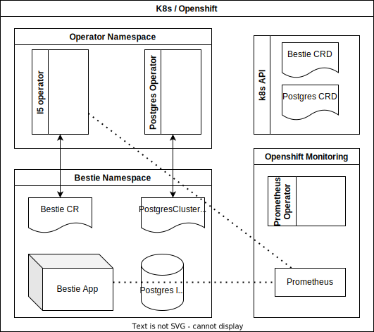

# L5 Operator demo

The goal is to develop a demo operator with level 5 capabilities to serve as an example to enhance workshop [content](https://drive.google.com/drive/u/0/folders/1l6FY1QdBq1IsmwM6Ib44A8h12OSKGJbe) as well as to present at kubecon for which a [proposal](https://drive.google.com/file/d/1GjJgBcJmywP3L64m1h4vZ68UIu-XJxMZ/view?usp=sharing) was submitted. The capabilities are being developed according to our interpretation of the requirements described by the operator capability descriptions given in the operator sdk [here](https://docs.google.com/document/d/1gNa2NQzlsHDdNHBYPczCytkuokEzBCFKjlxM12X5cdk/edit?usp=sharing)

# Requirements

- Install Crunchy Data Postgres Operator manually from [here](https://access.crunchydata.com/documentation/postgres-operator/v5/quickstart/), if you are not using OLM to install the L5 Operator

# High Level Deployment Diagram

An editable version of this diagram is on google drive via [draw.io](https://drive.google.com/file/d/1zwZDZyp_OqdqhPicXgfqIDRPZB4IYjwO/view?usp=sharing)



# Operator Installation

## Steps to follow while running on Vanilla Kubernetes

- The L5 Operator requires ingress controller to be installed if running on Vanilla kubernetes
- Steps for installing ingress controller for different clusters can be followed from [here](https://kubernetes.github.io/ingress-nginx/deploy/)
- Also make sure to install Crunchy Data Postgres Operator from [here](https://access.crunchydata.com/documentation/postgres-operator/v5/quickstart/)

## Different ways to run the Operator on Openshift

### 1. Run locally outside the cluster

```
git clone https://github.com/opdev/l5-operator-demo
 ```

``` 
cd <project>
 ```

``` 
make generate
 ```

``` 
make manifests
 ```

``` 
make install
 ```

``` 
make run
 ```

``` 
oc apply -f config/samples/pets_v1_bestie.yaml
 ```

### 2. Run as a Deployment inside the cluster

``` 
git clone https://github.com/opdev/l5-operator-demo
 ```

``` 
cd <project>
 ```

``` 
make generate
 ```

``` 
make manifests
 ```

- Build and push your image to the location specified by IMG:

``` 
make docker-build docker-push IMG=<some-registry>/<project-name>:tag 
```

- Deploy the controller to the cluster with image specified by IMG:

``` 
make deploy IMG=<some-registry>/<project-name>:tag
 ```

### 3. Deploy the Operator with OLM

```
operator-sdk run bundle <operator-bundle-image>
```

### 4. Download from the Operator Hub [here](https://operatorhub.io/)

